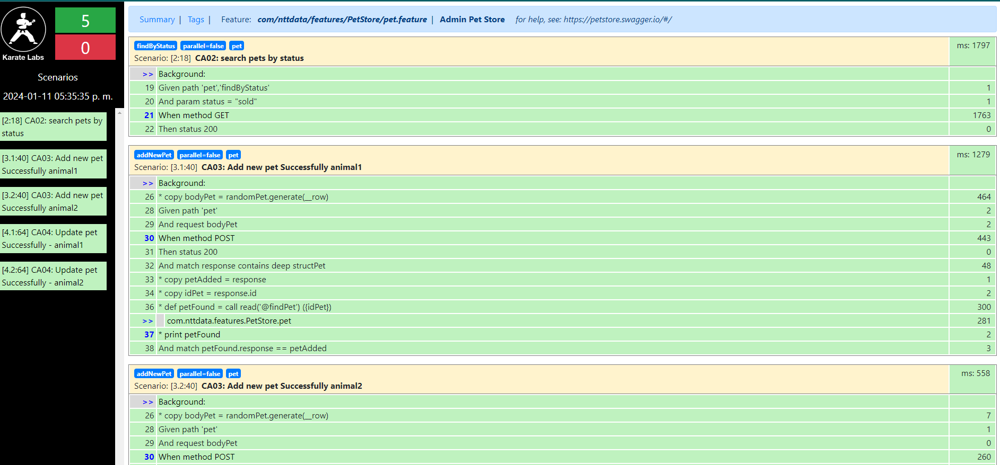

# CHALLENGE QA API - Automatización con Karate DSL

## Requisitos Previos

Antes de comenzar, asegúrese de tener instaladas las siguientes herramientas en su sistema:

- **Gradle:** Se requiere la versión 7.6.1. Puede establecer la variable de sistema correspondiente.
- **IDE:** Se recomienda utilizar IntelliJ IDEA para un entorno de desarrollo eficiente.
- **JDK:** Asegúrese de tener instalado el Java Development Kit en su versión 17.
- **Git:** Necesitará la herramienta Git para clonar el repositorio.

## Configuración del Proyecto

1. **Clonar el Repositorio:**

   ```bash
   git clone https://github.com/byronlopezec/karate-api.git
   cd karate-api
   ```
2. **Construir Repositorio:**

   Abra Su IDE o terminal favorito y construya el proyecto con el siguiente comando:

    ```bash
      gradle build
      ```
3. **Construir Repositorio desde Intellij Idea:**

En su IntellIJ IDEA de Click sobre el proyecto y luego en contruir:

<p align="center">
  
</p>


## Ejecución 
1. **Ejecutar Proyecto por terminal**

      ```bash
         ./gradlew test
      ```
2. **Ejecutar Proyecto desde intellij**
<p align="center">
  
</p>

## Ver Resultados
1. **Vaya a la carpeta build**
2. **Abra el archivo build/karate-reports/karate-summary.html en su navegador favorito**
3. **Tambien puede ver el reporte cucumber en la ruta build/cucumber-html-reports/**_

   

## Créditos:
Autor: Ing. Byron López
